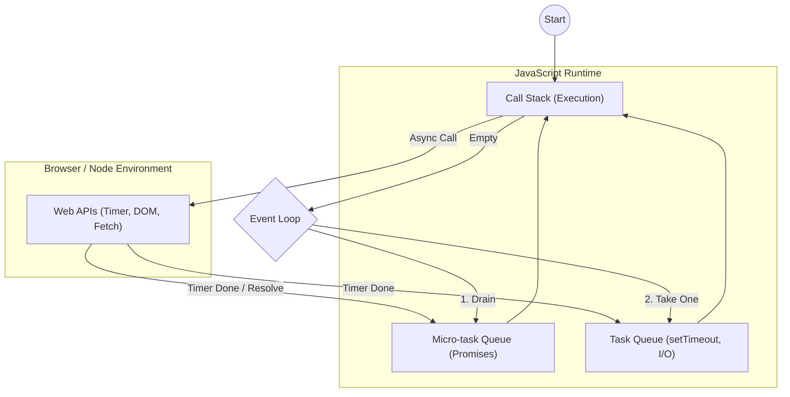

# Lesson 4.1: The Callback Pattern & The Event Loop

## Objectives
By the end of this lesson, you will be able to:
- **Explain** how JavaScript handles asynchronous operations using the callback pattern.
- **Visualize** the roles of the Call Stack, Web APIs, Task Queue, and Event Loop.
- **Write and debug** asynchronous code using `setTimeout` and DOM events.
- **Identify** "Callback Hell" and apply strategies (modularization, named functions) to avoid it.

---

## 1. Synchronous vs. Asynchronous JavaScript

### Synchronous (Blocking)
JavaScript is a **single-threaded** language, meaning it can only do one thing at a time. In synchronous execution:
- Code runs line-by-line from top to bottom.
- Each operation must finish before the next one starts.
- If a task takes a long time (e.g., a massive loop), the entire browser "freezes."

### Asynchronous (Non-Blocking)
Asynchronous code allows JavaScript to initiate a long-running task and move on to the next line immediately. When the task completes, a "callback" function is executed.

```javascript
console.log('1. Start');

// Asynchronous operation (Timer)
setTimeout(() => {
  console.log('2. Middle');
}, 0);

console.log('3. End');

/*
Output Order:
1. Start
3. End
2. Middle
*/
```
> [!IMPORTANT]
> Even with a delay of `0`ms, `setTimeout` is asynchronous. It tells the browser: "Run this function as soon as the current execution stack is finished."

---

## 2. Anatomy of the Event Loop

To understand how `setTimeout` works, we need to look at the JavaScript Runtime Environment.

### The Components
1. **Call Stack**: Where your code is executed (LIFO - Last In, First Out).
2. **Web APIs**: Provided by the browser (e.g., DOM, `fetch`, `setTimeout`). These handle the heavy lifting outside the main thread.
3. **Task Queue (Macro-tasks)**: Holds callbacks from timers and I/O.
4. **Micro-task Queue**: Holds callbacks from Promises (`.then`, `.catch`). **Micro-tasks always have higher priority than Macro-tasks.**
5. **Event Loop**: Monitors the Call Stack and the Queues. If the Call Stack is empty, it pushes the next waiting task onto the stack.

### Visualizing the Flow


---

## 3. The Callback Pattern

A **callback** is a function passed into another function as an argument, to be executed later.

### 3.1 Common Sources
- **Timers**: `setTimeout(cb, ms)`
- **DOM Events**: `btn.addEventListener('click', cb)`
- **I/O Operations**: `fs.readFile('data.txt', cb)` (Node.js)

### 3.2 The "Error-First" Pattern
In professional JavaScript (especially Node.js), callbacks often follow the error-first convention:
```javascript
function fetchData(id, callback) {
  setTimeout(() => {
    const success = true;
    if (success) {
      callback(null, { id: id, name: "Mctaba Student" }); // (error, data)
    } else {
      callback("Failed to fetch data");
    }
  }, 1000);
}

fetchData(1, (err, user) => {
  if (err) return console.error(err);
  console.log("User:", user.name);
});
```

---

## 4. Callback Hell (The Pyramid of Doom)

When multiple asynchronous operations depend on each other, callbacks start nesting deeply, making the code unreadable.

```javascript
// Callback Hell example
login(user, pass, (userData) => {
  getProfile(userData.id, (profile) => {
    getPosts(profile.id, (posts) => {
      saveToCache(posts, () => {
        console.log('Sequence Complete!');
      });
    });
  });
});
```

### Solutions to Callback Hell
1. **Named Functions**: Instead of anonymous inline functions, define them separately.
2. **Modularization**: Break steps into small, reusable utility functions.
3. **Promises / Async-Await**: The modern way to handle this (covered in Lesson 4.2).

---

## 5. In-Class Activity: Simulating Steps

**Goal:** Create a sequence of asynchronous steps using callbacks.

1. Create three variables: `step1`, `step2`, `step3`.
2. Each should take a callback and use a random delay.
3. Chain them together.

```javascript
const step1 = (cb) => {
  console.log("Starting Step 1...");
  setTimeout(() => cb(null, "Result 1"), Math.random() * 1000);
};

const step2 = (res1, cb) => {
  console.log("Starting Step 2 with:", res1);
  setTimeout(() => cb(null, "Result 2"), Math.random() * 1000);
};

// Exercise: Chain step1 and step2, then refactor using named functions.
```

---

## 6. Assignment: Sequential Task Runner

### Task 1: `delay(ms, cb)`
Create a utility function that wraps `setTimeout`.

### Task 2: `runTasks(tasks, finalCb)`
Create a function that takes an array of functions and runs them **one after another**.

```javascript
const tasks = [
  (next) => { console.log("A"); next(); },
  (next) => { console.log("B"); next(); },
  (next) => { console.log("C"); next(); }
];

runTasks(tasks, () => console.log("All finished!"));
```

**Stretch Goal:** Modify `runTasks` to handle a "concurrency" limit (e.g., allow 2 tasks to run at once).
